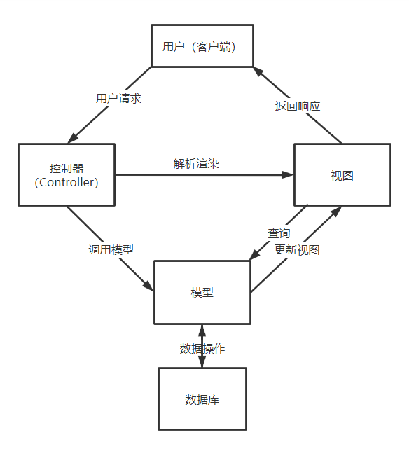
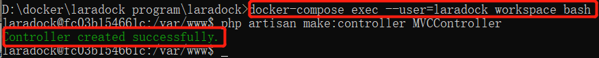
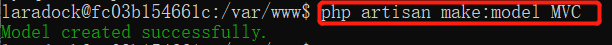
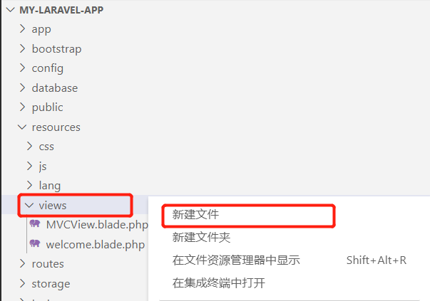
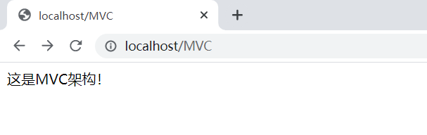

MVC架构
============================================

简介
~~~~~~
架构模式是一个通用的、可重用的解决方案，用于在给定上下文中的软件体系结构中经常出现的问题。架构模式与软件设计模式类似，但具有更广泛的范围。

MVC（Model View Controller）是软件工程中的一种软件架构模式，它把软件系统分为模型（M）、视图（V）和控制器（C）三个基本部分。用一种业务逻辑、数据、界面显示分离的方法组织代码，将业务逻辑聚集到一个部件里面，在改进和个性化定制界面及用户交互的同时，不需要重新编写业务逻辑。此模式透过对复杂度的简化，使程序结构更加直观。

MVC架构是交互式应用中广泛使用的架构。实现一种动态的程序设计，使程序结构更加直观。

MVC部件
~~~~~~~~~~~~

模型（Model）
------------------

模型是应用程序中用于处理应用程序数据逻辑的部分，通常模型对象负责在数据库中存取数据。

模型接受视图请求的数据，并返回最终的处理结果。

在Laravel中，模型就是一个快速操作数据库（准确的说是对应的数据表，一个模型对应一个数据表）的方法，可以实现增删改查等操作。

视图（View）
----------------

视图是应用程序中处理数据显示的部分，通常视图是依据模型数据创建的。

视图是是应用中处理响应给客户端的页面的部分，用于跟用户进行交互。

控制器（Controller）
--------------------------

控制器是应用程序中处理用户交互的部分，通常控制器负责从视图读取数据，控制用户输入，并向模型发送数据。

可以理解为从用户接收请求, 将模型与视图匹配在一起，共同完成用户的请求。

下面，我们将从流程上来理解MVC架构的工作模式和运行过程，更好地明白每个MVC部件在工作模式中起到的作用和实现的功能。

  图4.2.1 MVC架构的工作模式

MVC的基本使用
~~~~~~~~~~~~~~~~~

通过对MVC架构模式有了一定的了解认识，本节将介绍MVC架构模式在 Laravel 中的基本使用。

**1.** **注册路由**

在第一节中，我们已经介绍过路由的命名和基本使用方法。下面，我们将在路由文件 my-laravel-app/app/Http/routes.php 中注册一个新的路由。
双击进入到文件routes.php 下，添加如下列程序清单所示的第4行、第10行代码：

.. code-block:: php
  :linenos:

  <?php

  use Illuminate\Support\Facades\Route;
  use App\Http\Controllers\MVCController;

  Route::get('/', function () {
    return view('welcome');
  });

  Route::get('/MVC', [MVCController::class, 'index']);

在这里，引入了MVC控制器命名空间；定义注册了一个路由，匹配方法为get，跳转路径URL为 /MVC,调用了MVCController控制器中的index方法。

**2.** **创建控制器**

在 Laravel 中创建控制器由两种方式，分别是手动创建和artisan命令行工具创建。在这里，
我们介绍用artisan命令行工具创建MVCController控制器。

首先进入laradock容器的工作区并运行创建控制器指令，然后保持命令行运行，不要关闭。

.. code-block:: php
  :linenos:

  docker-compose exec --user=laradock workspace bash //进入工作区指令

  php artisan make:controller MVCController //创建控制器指令

如下图所示，则说明已进入工作区，并成功创建了一个MVCController控制器。

  图4.2.2 成功创建MVCController控制器

在以上步骤都顺利完成后，双击打开 app/Http/Controllers/MVCController.php文件，
添加如下列程序清单所示的第3-5行代码,下面按照顺序对这些语句进行解释：

（1）第1行代码：定义类MVCController继承基类Controller

（2）第3至第5行代码：声明index函数

（3）第4行代码：结果返回调用模型MVC.php中的index函数

.. code-block:: php
  :linenos:

  class MVCController extends Controller
  {
      public function index(){
          return MVC::index();
      }
  }

**3.** **创建模型**

创建模型，首先我们新建一个MVC模型，命令行工作区下运行指令：

.. code-block:: php
  :linenos:

  php artisan make:model MVC

  图4.1.3 创建模型

创建完成后，双击打开app/Models/MVC.php，添加如下列程序清单所示的第3-6行代码。

.. code-block:: php
  :linenos:

  class MVC extends Model
  {
      public static function index()
      {
          return view("MVC");
      }
  }

**4.** **创建视图**

完成了以上步骤，最后我们需要创建一个MVC视图。双击打开 resources/views,新建一个PHP文件，文件名为MVC.blade.php。

  图4.2.4 新建MVC视图

完成视图创建后，在视图文件中添加以下语句：

.. code-block:: php
  :linenos:

  这是MVC架构！

以上步骤完成，自此完成了一个基本MVC架构的搭建。下面访问地址 http://localhost/MVC ，如图所示。

  图4.2.5 MVC运行结果