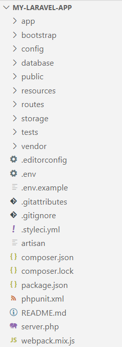
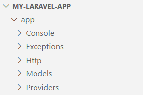

目录结构
============================================

Laravel 默认的目录结构试图为不管是大型应用还是小型应用提供一个良好的起点。同时通过对项目目录结构的研究，有利于我们迅速的掌握框架各个目录所完成的具体功能。

通过这种规范的目录结构，可以更好地实现文件的自动加载和分类。当然，我们也可以按照自己的要求自由地组织Laravel 框架的结构。
Laravel 对于指定类志在何处被加载没有任何限制，只需要Composer 实现自动加载。

根目录
~~~~~~~~~~~~~~~~~~~~~~~~~~~

默认的Laravel 框架应用程序是符合规范的，所以相应的目录结构也是固定的，不同目录加载了不同的功能文件。
Laravel框架根目录组织结构如下：

  图5-3-1 Laravel框架的根目录结构

下面，我们将依个对Laravel应用的目录结构进行说明解释，有利于迅速掌握框架各个目录所完成的具体功能。

表- Laravel应用的目录结构说明  

  .. list-table::
    :widths:  15 15 70
    :header-rows: 1

    * - 根目录
      - 说明
      - 功能

    * - app
      - 应用目录
      - 存放应用的核心代码，用户构建应用的大部分工作都在这个目录下进行。包括路由文件、控制器文件、模型文件等

    * - bootstrap 
      - 启动目录
      - 存放 Laravel 框架启动和自动加载配置的文件

    * - config
      - 配置目录
      - 存放应用常用的配置文件信息

    * - database
      - 数据库目录
      - 存放数据迁移和数据填充文件

    * - public
      - 对外公开目录
      - 应用的入口目录，存放应用入口文件index.php，以及静态资源文件（CSS、Javascript、images等）
  
    * - resources
      - 资源目录
      - 存放非 PHP 资源文件，如视图模板、语言文件等
 
    * - routes
      - 路由目录
      - 存放了应用定义的所有路由

    * - storage
      - 文件存储目录
      - 存放编译后的Blade视图模板、基于文件的session、文件缓存和日志等文件

    * - tests
      - 测试目录
      - 存放自动化测试文件

    * - vendor
      - Vendor 目录
      - 存放依赖库文件，通过composer安装的依赖包。其中包含Laravel框架源代码

另外地，以下这三个文件也都实现了不同的功能：

-  .env文件：主要设置一些系统相关的环境配置文件信息
-  artisan（脚手架）文件：主要用于生成的代码，比如生成控制器，模型文件等
-  composer.json文件:依赖包配置文件，声明当前需要的软件依赖

app目录介绍
~~~~~~~~~~~~~~

应用的核心代码、大部分代码都存放在 app 目录下，该目录位于命名空间App下，通过composer来自动加载其中的文件。
在使用 Laravel框架开发项目时，几乎大部分的新开发功能也会放置在这个目录下。下面介绍app目录下的组织结构。

**1.** **子目录**

  图5-3-2 app目录下的子目录结构

-  Console ：包含应用所有自定义的 Artisan 命令
-  Exceptions ：包含应用的异常处理器，同时还是处理应用抛出的任何异常的地方
-  Http：包含了控制器、中间件以及表单请求等，是应用与 Laravel框架源代码等外部库交互的地方
-  Models：包含了所有的 Eloquent 模型类文件
-  Providers ：包含应用的服务提供者的相关文件

**2.** **其他目录**

其他目录默认不存在，会在通过 Artisan 命令 make 生成相应类的时候自动生成到 app 目录下。

-  Events ：存放与事件相关的类
-  Jobs ：存放消息队列任务
-  Listeners ：存放监听事件类文件
-  Broadcasting ：存放所需的所有广播频道类
-  Mail ：存放应用所有邮件相关类
-  Policies ：存放应用所有的授权策略类
-  Rules ：存放应用的自定义验证规则对象