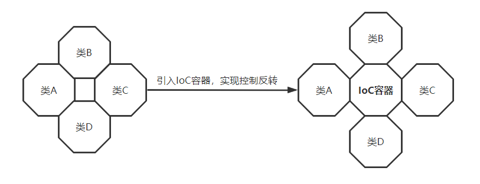
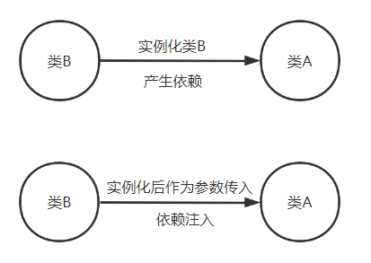

服务容器
============================================

简介
~~~~~~~~~

在 Laravel 框架中，服务容器是整个系统功能调度配置的核心是 Laravel 框架的“心脏”所在，
因为它提供了整个框架运行过程中需要的一系列服务。

服务容器从程序角度上难以理解其功能含义，只需从字面上理解。容器是用来装东西的器皿，而服务容器是用来装服务的。

在 Laravel 中，我们可以将服务理解为系统运行中需要的东西，如对象、文件路径、系统配置等，服务容器就是这些东西的载体，
在程序运行过程中动态地提供这些服务，提供这些资源。

控制反转和依赖注入
~~~~~~~~~~~~~~~~~~~~

说到服务容器，服务容器有两个重要概念IOC(控制反转)和DI(依赖注入)。

这两者目的是为了降低软件开发的复杂度，是提升模块低耦合、高内聚的一种设计模式。

-  控制反转：容器控制应用程序，由容器反向的向应用程序注入应用程序所需要的外部资源。

-  依赖注入：应用程序依赖容器创建并注入它所需要的外部资源。

**1.** **控制反转**

控制反转的作用就是实现模块或对象的解耦，将组件间的依赖关系从程序内部提到外部容器Ioc容器来管理。。

引入了IoC容器后，对象A、B、C、D之间没有了依赖关系，这时候控制权属于IoC容器。即控制权反转了，从某个对象类转到了IoC容器。

  图5-5-1 控制反转

**2.** **依赖注入**

对于依赖注入，首先要明白依赖是一种关系。

当在类A中创建了类B的实例，就可以说A依赖于B。这时候会存在改变实例化的对象类B时，需要去到类A中修改的耦合问题。

所以，将类B实例作为类A构造器参数进行传入，而不是直接在类A中实例化。转由外部传入依赖对象，通过动态注入的方式实现，这就是依赖注入。

  图5-5-2 依赖注入

解释完服务容器的主要作用 IOC(控制反转)和DI(依赖注入)，下面将介绍服务容器的使用。

服务绑定
~~~~~~~~~~~~~

在服务容器生成后，首先要做的就是向其中装服务，也就是所谓的服务绑定，服务容器绑定都是在服务提供者中完成。

在服务提供器中，总是可以通过 $this->app 属性访问容器。

**1.** **简单绑定**

使用 bind 方法注册一个绑定，该方法需要两个参数，第一个参数是想要注册的类名或接口名称，第二个参数是返回类的实例的闭包：

.. code-block:: php
  :linenos:

  $this->app->bind('HelpSpot\API', function ($app) {
    return new HelpSpot\API($app->make('HttpClient'));
  });

**2.** **绑定单例**

singleton 方法绑定一个只会解析一次的类或接口到容器，然后接下来对容器的调用将会返回同一个对象实例：

.. code-block:: php
  :linenos:

  $this->app->singleton('HelpSpot\API', function ($app) {
      return new HelpSpot\API($app->make('HttpClient'));
  });

**3.** **绑定实例**

instance 方法绑定一个已存在的对象实例到容器，随后调用容器将总是返回给定的实例：

.. code-block:: php
  :linenos:

  $api = new HelpSpot\API(new HttpClient);
  $this->app->instance('HelpSpot\API', $api);

**4.** **绑定基本值**

当有一个类不仅需要接受一个注入类，还需要注入一个基本值（比如整数）。可以使用上下文绑定来轻松注入这个类需要的任何值：

.. code-block:: php
  :linenos:

  $this->app->when('App\Http\Controllers\UserController')
            ->needs('$variableName')
            ->give($value);

服务解析
~~~~~~~~~~~

前面介绍了服务绑定的内容，当服务已经绑定到服务容器之后，就可以在之后随时获取，称为服务解析。

make方法可以从容器中解析对象，接收想要解析的类名或接口名作为参数。

如果所在的代码位置访问不了 $app 变量，可以使用辅助函数resolve。

某些类的依赖不能通过容器来解析，可以通过关联数组方式将其传递传递到 makeWith 方法来注入。

.. code-block:: php
  :linenos:

  $api = $this->app->make('HelpSpot\API');  //make方法

  $api = resolve('HelpSpot\API'); //辅助函数resolve

  $api = $this->app->makeWith('HelpSpot\API', ['id' => 1]); //关联数组makewith

容器事件
~~~~~~~~~~~

服务容器每次解析对象时会触发一个事件，可以使用 resolving 方法监听这个事件：

.. code-block:: php
  :linenos:

  $this->app->resolving(function ($object, $app) {
      
  });
    
  $this->app->resolving(HelpSpot\API::class, function ($api, $app) {
      
  });