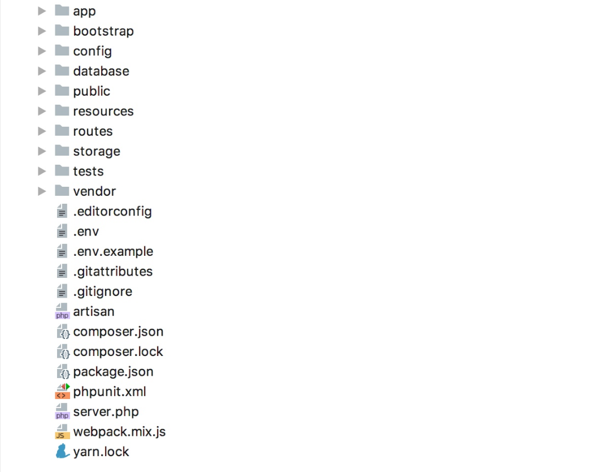
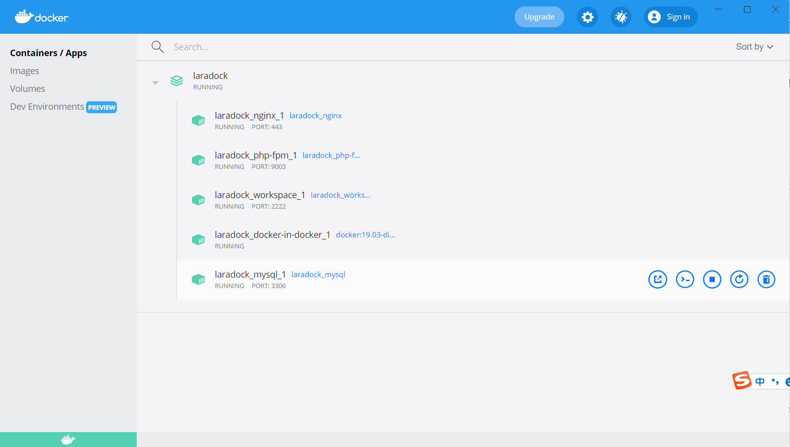
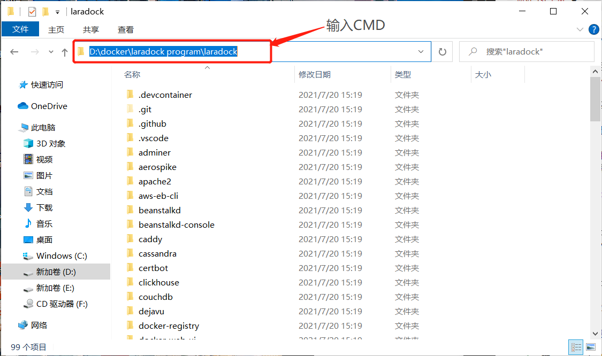

HELLO WORLD
============================================

实验内容
~~~~~~~~~~~~~~~~

Laradock 是一套为 PHP 提供的完整 Docker 本地开发环境，有助于在 Docker 上运行 PHP 应用程序。
包含了预先打包的Docker镜像，所有预先配置都是为了提供一个完美的PHP开发环境。本节的实验内容
就是基于Laradock开发环境创建并运行一个HelloWorld工程。

实验原理
~~~~~~~~~~~~

**1.** **目录结构**

下列是Laravel项目my-laravel-app的目录结构：

  图4-1-1 my-laravel-app项目的目录结构

**2.** **目录说明**

下列是关于my-laravel-app项目的目录结构说明：

-  app：存放应用核心代码，如模型、控制器、命令、服务等
-  bootstrap：存放 Laravel 框架每次启动时用到的文件
-  config：用于存放项目所有配置文件
-  database：存放数据库迁移和填充类文件
-  public：Web 应用入口目录，用于存放入口文件 index.php 及前端资源文件（CSS、JS、图片等）
-  resources：用于存放与非 PHP 资源文件，如视图模板、语言文件、待编译的 Vue 模板、Sass、JS 源文件
-  routes：项目的所有路由文件都定义在这里
-  storage：用于存放缓存、日志、上传文件、已经编译过的视图模板等
-  tests：存放单元测试及功能测试代码
-  vendor：通过 Composer 安装的依赖包都存放在这里，通常该目录会放到 .gitignore 文件里以排除到版本控制系统之外

**3.** **路由的简单定义**

对Laravel 应用框架而言，通过 HTTP 协议处理用户请求并返回响是核心必备功能，对任何一个 Web 应用框架而言，通过 HTTP 协议处理用户请求并返回响应都是核心必备功能。
最基本的 Laravel 路由只接收一个 路径（URL） 和一个闭包，并以此为基础提供一个非常简单优雅的路由定义方法 ：

.. code-block:: php
  :linenos:

  Route::get('hello',function(){
    return 'Hello World!';
  });

这里定义了个路由，匹配方法为Get请求，导向路径为../hello，路由方法，返回输出“Hello World！”。

**4.** **web.php文件**

web.php文件用于处理终端用户通过 Web 浏览器直接访问的请求。

下面介绍下web.php文件的程序结构，程序清单如下：

.. code-block:: php
  :linenos:

  <?php

  use Illuminate\Support\Facades\Route;

  Route::get('/', function () {
    return view('welcome');
  });

第三行为引入类文件,类文件包含了route方法。

第五行为匹配get请求路由。

第六行为返回响应视图'welcome.blade.php'。

实验步骤
~~~~~~~~~~~~

首先用 Visual Studio Code 软件打开my-laravel-app文件，找到并进入目录my-laravel-app/routes目录下，打开web.php文件，如图4-1-2所示。

  图4-1-2  web.php文件

在"路由方法"区添加第4-6行代码，定义一个hello的路由，返回输出"Hello World!"，如程序清单所示

.. code-block:: php
  :linenos:

  Route::get('/', function () {
    return view('welcome');
  });
  Route::get('hello',function(){
    return 'Hello World!';
  });

最后，按Crtl+S键保存，打开浏览器并访问地址：http://localhost/hello ,
执行结果如图4-1-3所示，可以看到网页上打印出了"Hello World!"。

  图4-1-3 Hello World运行结果