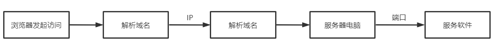

Web程序的访问流程
============================================

Web应用程序是一种可以通过Web访问的应用程序，程序的最大好处是用户很容易访问应用程序，用户只需要有浏览器即可，不需要再安装其他软件。
它是基于Web的，是典型的浏览器/服务器架构的产物。一个Web应用程序是由完成特定任务的各种Web组件（web components)构成的并通过Web将
服务展示给外界。在实际应用中，Web应用程序是由多个Servlet、JSP页面、HTML文件以及图像文件等组成。所有这些组件相互协调为用户提供一组完整的服务。

web程序的访问流程：

**1.** **浏览器输入地址进行访问** 

**2.** **将输入的网址（域名）进行解析**

浏览器会先从客户端系统（电脑）查询域名对应的IP地址，如果找到了，浏览器就向这个IP地址发出访问请求；

如果找不到对应的IP地址，浏览器就会发起DNS请求，向DNS服务器（专门负责域名解析的服务器）查询IP地址，并保存到电脑，这时候浏览器就可以正常向匹配的服务器发出访问请求。

**3.** **浏览器发送HTTP请求**

请求信息通过浏览器进行包装，使其符合HTTP协议（应用层），然后通过传输层、网络层、链路层将信息不断处理，最后将处理后的信息传到网络上，通过网络传送到指定的服务器上。

**4.** **服务器接收到网络上传输来的请求信息**

服务器端通过TCP/IP各层的信息，最终请求信息中获取了需求信息。

通过服务器判断，同意了客户端的请求，从资源库里（系统文件）里找到相应的资源，或者运行相应的程序，将资源/结果整理成符合HTTP协议的响应信息（携带状态码），准备发回给客户端。

如果服务器没有同意客户端的请求，服务器无法运行，那么服务器也会整理一个符合HTTP协议的响应信息（携带状态码），准备发回给客户端。

**5.** **客户端的浏览器通过端口获取到服务器传回的数据**

获取到数据后，进行解析、渲染后，通过端口传输到服务软件，呈现出来。
