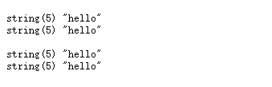
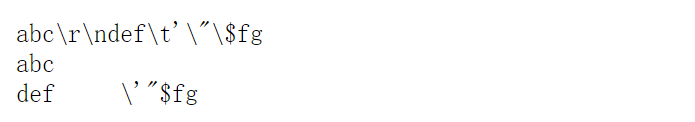

字符串
============================================

字符串定义语法
~~~~~~~~~~~~~~~~
- 单引号字符串：使用单引号包裹
- 双引号字符串：使用双引号包裹
- nowdoc字符串：没有单引号的单引号字符串
- heredoc字符串：没有双引号的双引号字符串

举例
---------
.. code-block:: php
    :linenos:

    <?php
        $str1='hello';
        $str2="hello";
        $str3=<<<EOD
             hello
            EOD;
        $str4=<<<'EOD'
             hello
            EOD;
        var_dump($str1,$str2);
        echo ' ';
        var_dump($str3,$str4);

输出结果:

可看出定义结果差别不大，在定义较长字符串时，一般使用后两种方法。

字符串转义
~~~~~~~~~~~~~~~~~~
含义：在计算机通用协议中，有一些特定的方式定义的字母，系统会特定处理

- \\$:在php中使用$符号作为变量符号，因此需要特定识别
- \\':在单引号字符串中显示单引号
- \\"：在双引号字符串中显示双引号
- 其余转义符号与C语言相同

转义符号在单引号定义的字符串和双引号定义的字符串又有不同效果

举例（定义字符串识别转义符号）
--------------------------------
.. code-block:: php
    :linenos:

    <?php
        $str1 = 'abc\r\ndef\t\'\"\$fg';
        $str2 = "abc\r\ndef\t\'\"\$fg";
        echo $str1 ,' ',$str2;

输出结果：

结果显示，在单引号定义的字符串中，能识别  **\\'**,双引号定义的字符串中，能识别 **\\",\\r,\\n,\\t,\\$**，因此双引号中可以解析变量。
 
双引号中变量识别的规则

- 变量本身系统能够与后面的内容区分：应该保证变量的独立性，不要让系统难以区分
- 使用变量专业标识符（区分），给变量加上一组大括号{}

字符串长度
~~~~~~~~~~~~~~~~~~
基本函数strlen()：得到字符串的长度（字节为单位，一个中文为三个字节）

字符串相关函数（要求知道功能，具体需要使用时可以查找对应函数）
~~~~~~~~~~~~~~~
1. 转换函数：
 - implode():将数组中的元素按照某个规则连接成一个字符串
 - Explode():将字符串按照某个格式分割变成数组
 - str_split():按照指定长度拆分字符串得到数组
2. 截取函数：
 - trim():本身默认用于去除两边的空格，但也可以指定要去除的内容，是按照指定的内容去除两边有的内容，知道碰到有一个不是目标字符为止
 - ltrim():去除左边的
 - rtrim():去除右边的
3. 截取函数：
 - substr():指定位置开始截取字符串，可以截取指定长度（起始位置从0开始，若不指定长度，则截取到最后）
 - strstr():从指定位置开始，截取到最后（可以用来去文件后缀名）
4. 查找函数：
 - strpos():判断字符在目标字符串中首次出现的位置
 - strrpos():判断字符在目标字符串中最后出现的位置
5. 大小转换函数：
 - strtolower():全部小写
 - strtoupper():全部大小
 - Ucfirst():首字母大写
6. 替换函数：
 - str_replace()：将目标字符串中部分字符替换
7. 格式化函数：
 - printf()/sprintf():格式化输出数据
8. 其他：
 - str_repeat():重复某个字符串n次
 - str_shuffle():随机打乱某个字符串