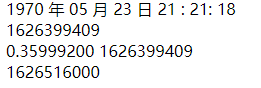
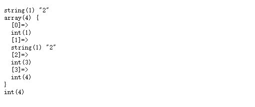

系统函数
============================================

有关输出的函数
~~~~~~~~~~~~~~~~~~~~~~~~

- print():类似于echo输出提供的内容，本质是一种结构（不是函数），返回1,可以不使用括号。
- print_r()：类似于var_dump，但是比var_dump简单，不会输出数据的类型，只会输出值（数组打印比较多）
 
举例
---------------
.. code-block:: php
   :linenos:

   <?php
      echo print('hello  world ');
      print 'hello world ';
      $a = 'hello world';
      print_r($a);  
  

输出结果：

其中第二行的1为print的返回值

有关时间的函数
~~~~~~~~~~~~~~~~~~~~~~~~

- date():按照指定格式对对应的时间戳(从1970年格林威治时间开始计算的秒数)
- time()：获取当前时间对应的时间戳
- microttime():获取微秒级别的时间
- strtotime():按照规定格式的字符串转换成时间戳

举例
---------------
.. code-block:: php
   :linenos:

   <?php
      echo date(' Y 年 m 月 d 日 H : i: s',12345678),' ';  //输出格林威治时间后第12345678秒后的时间戳
      echo time(),' ';                                     //输出当前的时间
      echo microtime(),' ';                                
      echo strtotime('tomorrow 10 hours');

输出结果如下

其中Y,m,d,H,i,s分别为年，月，日，时，分，秒的格式

有关数学的函数
~~~~~~~~~~~~~~~~~~~~~~~~
   
- max():比较出参数中最大值
- min():比较出参数中最小值
- rand():得到一个随机数，指定区间的随机整数
- mt_rand():与rand()一样，只是底层结构不一样，效率比rand()高（建议使用）
- round():四舍五入
- celi():向上取整
- floor():向下取整
- pow():求指定数字的指定指数次结果
- abs():取绝对值
- sqrt():求平方根

举例
----------------
.. code-block:: php
      :linenos:
   
      <?php
         echo max(25,30),' ';           //比较25与30两个数较大的那个并输出
         echo min(25,30),' ';           //比较25与30两个数较小的那个并输出
         echo rand(25,30),' ';          //在25到30之间随机取一个数
         echo mt_rand(25,30),' ';       //在25到30之间随机取一个数
         echo ceil(0.5),' ';            //向上取整
         echo floor(0.5),' ';           //向下取整
         echo pow(2,8),' ';             //求2的8次方
         echo abs(-20),' ';             //求绝对值
         echo sqrt(25),' ';             //开方
    
   
输出结果如下
   
.. figure:: media/rst_system/system_math.png
    :alt: system_math
    :align: center

随机取数包括边界

有关函数的函数
~~~~~~~~~~~~~~~~~~~~~~~~
- function_exists():判断指定的函数名字是否在内存中存在（帮助用户不去使用一个不存在的函数，让代码安全性更高）
- func_get_arg():在自定义函数中去获取指定数值对应的参数
- func_get_args():在自定义函数中获取所有的参数（数组）
- func_num_args():获取当前自定义函数的参数数量

举例
----------------
.. code-block:: php
   :linenos:
       
   <?php
      echo ' <pre>'
      function test($a,$b){
      var_dump(func_get_arg(1));          //获取指定参数
      var_dump(func_get_args());         //获取所有参数
      var_dump(func_num_args());          //获取参数数量
      }
      function_exists('test') && test(1,'2',3,4);
        
输出结果如下
       

   

func_get_args和func_num_args都是统计对应实参的数量

