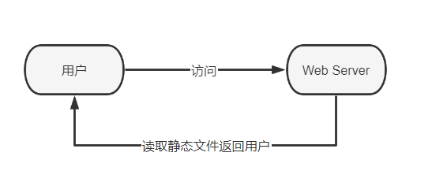
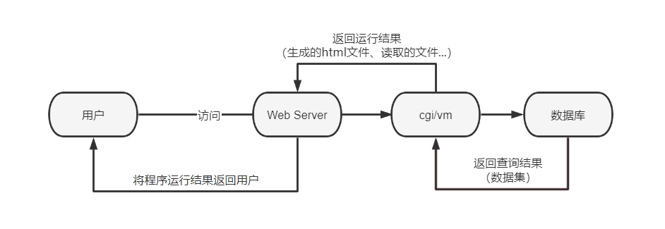

静态网站与动态网站的区别
============================================

静态网站
~~~~~~~~~~~

静态网站是指全部由HTML代码格式页面组成的网站，所有的内容包含在网页文件中。
网站主要是静态化的页面和代码组成，都有一个固定的URL，一般文件名均以htm、
html、shtml等为后缀。

-  网页内容一经发布到网站服务器上，无论是否有用户访问，每个静态网页的内容都是保存在网站服务器上的，也就是说，静态网页是实实在在保存在服务器上的文件，每个网页都是一个独立的文件
-  静态网页的内容相对稳定，因此容易被搜索引擎检索
-  静态网页没有数据库的支持，在网站制作和维护方面工作量较大
-  静态网页的交互性较差，在功能方面有较大的限制

动态网站
~~~~~~~~~~~

动态网站指网站内容可根据不同情况动态变更的网站，一般情况下动态网站通过数据
库进行架构。动态网站除了要设计网页外，还要通过数据库(SQL Server、MySQL、
Oracle)和编程序(.NET、PHP、Java)来使网站具有更多自动的和高级的功能。

-  动态网页以数据库技术为基础，可以大大降低网站维护的工作量
-  动态网页实际上并不是独立存在于服务器上的网页文件，只有当用户请求时服务器才返回一个完整的网页
-  动态网页的内容和显示效果会根据用户的要求和选择而动态地改变和响应

动态网站与静态网站最根本的区别是在网页在服务器端运行状态不同。

  图2-2-1 静态网站运行状态

  图2-2-2 动态网站运行状态